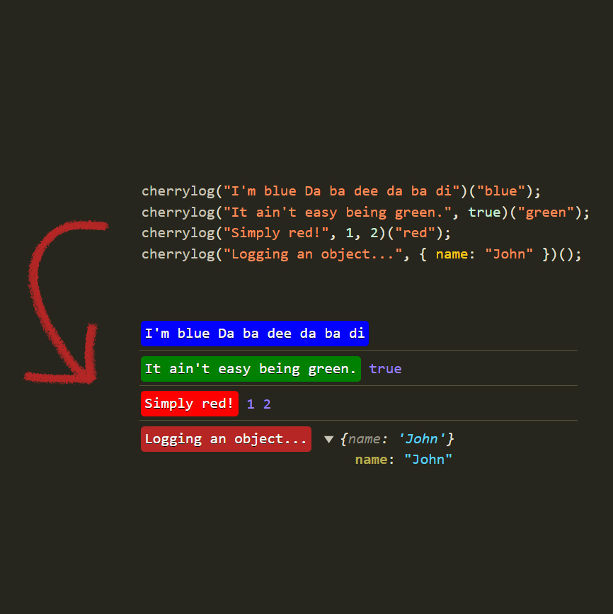

## 📙Description

Turn debugging from a chore into a carnival with colorized logs that’ll make bugs dance away!

A refined console.log for coders with a taste for elegance.

_Light, Clean & Simple_

## 💾 Install

`npm install cherrylog --save-dev`

## 🛠️ Usage

```js
cherrylog("I'm blue Da ba dee da ba di")("blue");
cherrylog("It ain't easy being green.", true)("green");
cherrylog("Simply red!", 1, 2)("red");
cherrylog("Logging an object...", { name: "John" })(); // defaults to the delicious cherry color
```



# Development

### 📦 BUILD (builds to /dist directory)

npm run build

### 🔂 Increment version before publishing package

npm version patch
